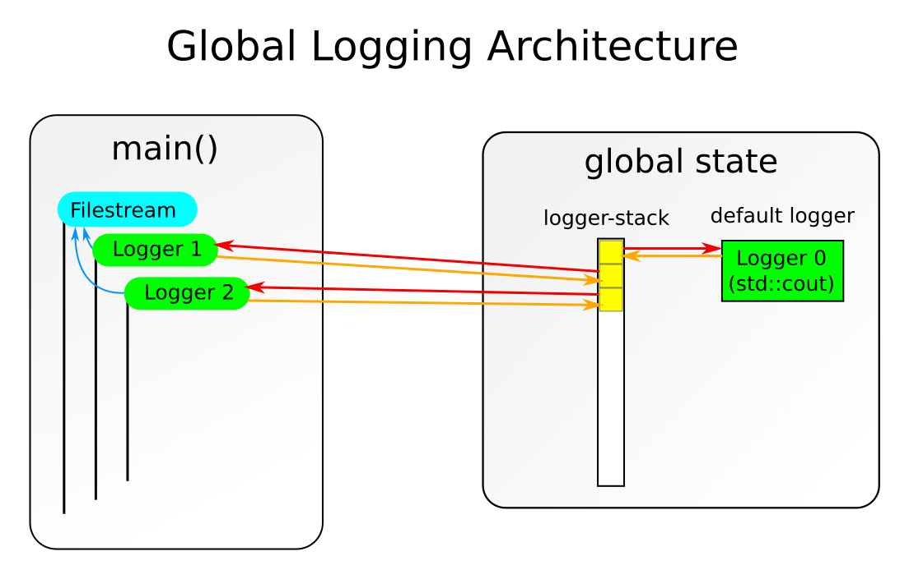

Architecture
============


Basic Logging
-------------

The library provides two functionalities to convert a set of values into
a log-message. The first one just concatenates the string-representation
of their arguments, the second one uses a printf-like interface (though
it is typesafe and accepts `%s` for every type of argument (other specifiers
than `s` will result in an exception, though `%%` to print a single `%` works
as expected).

To create a log-message that string is concatenated to a string-representation
of the loglevel (for example `[warn ]`) followed by a timestamp. For instance:

```
[note ][Wed Jun 24 13:18:37 2015]: foobar
```

Log-Targets
-----------

In Order to log, a target has to exist. Targets consist of a `std::ostream` and a
log-level (`logger::level`) and are represented by the `logger::log_target`-struct;
these should only ever be created by their constructors, since those ensure that
the stream-pointer is never null. (A log_target with a null stream-pointer results
in undefined behavior.)

It should also be noted that the `log_target`-object does **not** own the assigned
stream but will assume that it is outlived by the provided stream. This means that
code like the following will result in undefined behavior:

```cpp
logger::log_target open_logfile(const std::string& name) {
	std::ofstream stream{name};
	return logger::log_target{stream}; // ERROR: this will
	                                   // result in an use
	                                   // after free-bug!
}
```

Logger-Sets
-----------

It is not possible to log directly to a `logger::log_target`; instead
a logger-set has to be used. Logger-sets are collections of the log-targets
that they recieve in their constructor and permit sending messages to them.

If the sent message has a lower level then the minimum level of the log-target
in question, the message will not be sent to that target.

An important detail is that, unless otherwise requested by passing
`logger::auto_register::off` to the constructor, the logger-set will register
itself as the global logger (see next section) and will remain that until a new
logger will become that (though it will become the global logger again
once that other logger get's destroyed) or it goes out of scope.


The global Logger
-----------------

In order to permit easy logging from all functions without having to carry
around a logger-set via arguments, sinmple logger manages a global stack
of all (not explicitly not registered) logger-sets. All of those logger-sets
(or rather: pointers to them) are saved in that stack, as well as a back pointer
to that pointer in the logger-set itself.



The destructor of each logger-set will see whether it contains such a pointer and
will clear the pointer in the global stack by setting it to null and after that
removes all null-pointers from the end of that stack.

By default the stack contains one logger-set with static storage-duration that
will print everything with a loglevel of at least the default-level (`logger::level::note`)
to `std::cout`.

The move-constructor of a logger-set will re-adjust all pointers as needed,
so moving logger-sets around is perfectly save, unless they outlive `main()`,
in which case no guarantees will be made.

It is probably safe to write to the global logger even before entering `main()`,
though it should be noted that that kind of behavior is strongly discouraged
and bad coding-style to begin with. You have been warned! (Note that similar
things even apply to `std::cout`!)

In order to log to the global logger, just use the global logging functions
`logger::log` and `logger::logf` or their aliases with bound level `logger::warn`,
`logger::warnf`,`logger::note`, and so on.

Printable Types
---------------

The library uses a set of unary functions named `to_string` in the namespace
`logger::conv` that return a `std::string` to convert arbitrary types to
strings. By default functions for the following specific types are provided:

* `const std::string&`
* `std::string&&`
* `const char*`

In addition to those there is a catch-all template that recieves a
`const T&` and uses a stringstream to convert them. The stringstream in question
is unique to each call, meaning that it is in a clean state with default-formats
for everything.

In order to make any type printable, the easiest methods are to either provide
a normal output-operator (`<<`) or to add an unambigously better matching function
to the overload set. The later should be documented somewhere and might benefit
from being done directly in the logger-header if this seems reasonable.

In order to provide a better match than the generic `const T&` it is necessary
to add an overload that takes the exact type but isn't a template, or, in
case of class-templates, takes a more specialized template (aka the template as
arguments with it's arguments being the arguments to the function-template).

For better comprehension of the later see this example for how a `std::pair`
could be made loggable:

```cpp

namespace logger { namespace conv {

template<typename T1, typename T2>
std::string to_string(const std::pair<T1, T2>& p) {
	// be explicit about the namespaces to prevent problems
	// with ADL
	return '(' + logger::conv::to_string(p.first)  + ", "
	           + logger::conv::to_string(p.second) + ')';
}

}} //namespaces
```

Don't forget that non-template functions that are defined in headers **must** be
annotated as `inline`, since they are defined *inline*.

